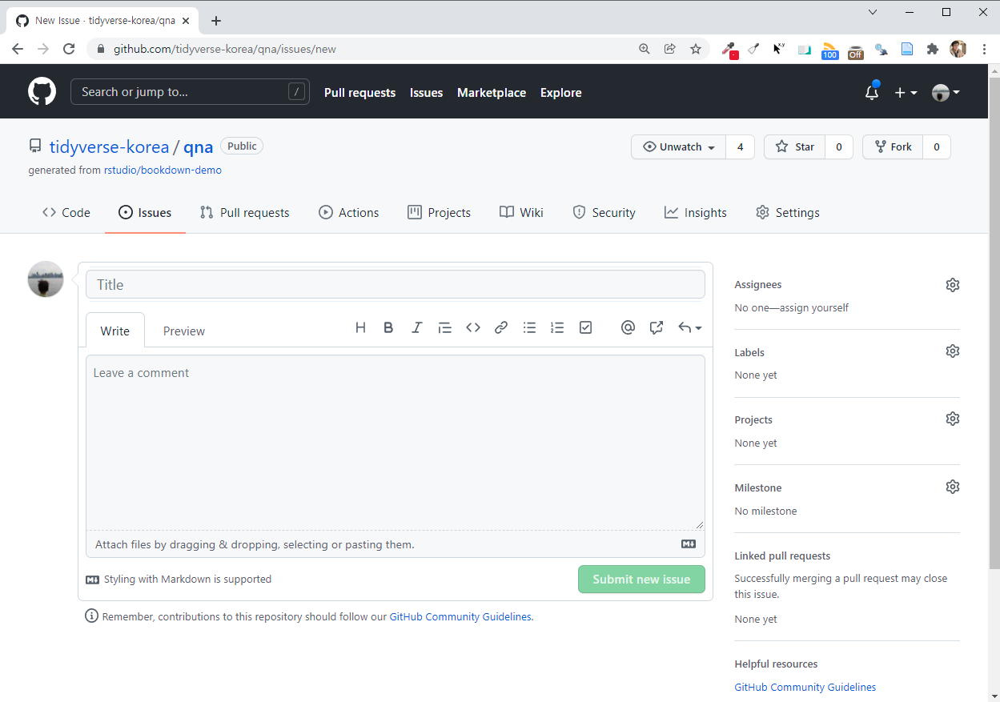

## 질문 방법 {#qna .unnumbered}

Github [`qna`](https://github.com/tidyverse-korea/qna/issues/) 저장소 이슈(Issues)에 질문을 남겨주세요.

{width="656"}

특히 [`reprex`](https://reprex.tidyverse.org/) 패키지 사용해서 관련 내용도 재현가능하게 만들어서 공유해 주시면 큰 도움이 되겠습니다.

-   [도와줘요 - `reprex`](https://aispiration.com/data-science/ds-r-reprex.html)
