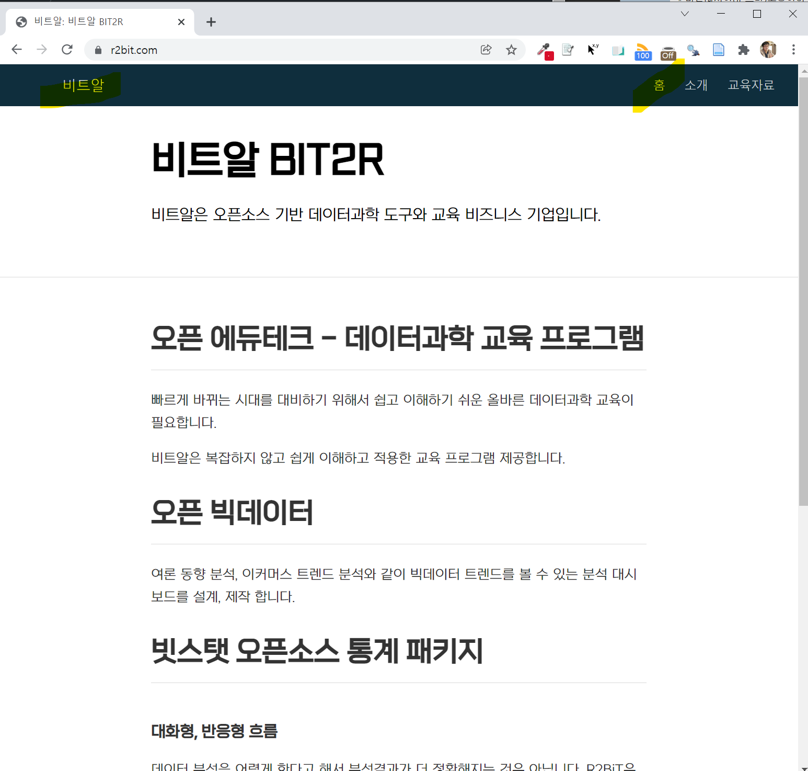

# 인코딩 {#encoding}

## `distill` 웹사이트 오류 {#distill}

`distill` 웹사이트를 제작할 때 발생하는 오류 중 하나가 인코딩(Encoding) 때분에 발생된다. 특히, 윈도우에서 이런 문제가 많은 다행히 R 4.2 버전부터 이런 문제가 완전히 해결되었다. 자세한 사항은 [Upcoming Changes in R 4.2 on Windows](https://developer.r-project.org/Blog/public/2021/12/07/upcoming-changes-in-r-4.2-on-windows/index.html)을 참고한다.



### 문제 발생 환경 {#distill-setting}

```{r distill-error, eval = FALSE}

==> rmarkdown::render_site(encoding = 'UTF-8')


Rendering: ./about.Rmd
  |.......................                                               |  33%
  ordinary text without R code

  |...............................................                       |  67%
label: setup (with options) 
List of 1
 $ include: logi FALSE

  |......................................................................| 100%
  ordinary text without R code


"C:/PROGRA~3/CHOCOL~1/bin/pandoc" +RTS -K512m -RTS about.knit.md --to html5 --from markdown+autolink_bare_uris+tex_math_single_backslash --output about.html --lua-filter "C:\Users\statkclee\Documents\R\win-library\4.0\rmarkdown\rmarkdown\lua\pagebreak.lua" --lua-filter "C:\Users\statkclee\Documents\R\win-library\4.0\rmarkdown\rmarkdown\lua\latex-div.lua" --standalone --variable toc-float=1 --highlight-style "C:/Users/statkclee/Documents/R/win-library/4.0/distill/rmarkdown/templates/distill_article/resources/arrow.theme" --template "C:\Users\statkclee\Documents\R\win-library\4.0\distill\rmarkdown\templates\distill_article\resources\default.html" "--metadata=link-citations:true" --include-in-header "C:\Users\STATKC~1\AppData\Local\Temp\RtmpQtqLdL\file246c372260e4html" --include-in-header "C:\Users\STATKC~1\AppData\Local\Temp\RtmpQtqLdL\file246c23bf5568html" --include-in-header "C:\Users\STATKC~1\AppData\Local\Temp\RtmpQtqLdL\file246c5e3338d3html" --include-in-header "C:\Users\STATKC~1\AppData\Local\Temp\RtmpQtqLdL\file246c33977afhtml" --include-before-body "C:\Users\STATKC~1\AppData\Local\Temp\RtmpQtqLdL\file246c55011736html" --include-before-body "C:\Users\STATKC~1\AppData\Local\Temp\RtmpQtqLdL\file246ca1c4598html" --include-before-body "C:\Users\STATKC~1\AppData\Local\Temp\RtmpQtqLdL\file246c180a7d23html" --include-after-body "C:\Users\STATKC~1\AppData\Local\Temp\RtmpQtqLdL\file246c4dada52html" --include-after-body "C:\Users\STATKC~1\AppData\Local\Temp\RtmpQtqLdL\file246c774c4b73html" --include-after-body "C:\Users\STATKC~1\AppData\Local\Temp\RtmpQtqLdL\file246c405752d2html" --include-in-header "C:\Users\STATKC~1\AppData\Local\Temp\RtmpQtqLdL\rmarkdown-str246c684b29da.html" --mathjax --variable "mathjax-url:https://mathjax.rstudio.com/latest/MathJax.js?config=TeX-AMS-MML_HTMLorMML" --include-in-header "C:\Users\STATKC~1\AppData\Local\Temp\RtmpQtqLdL\file246c7001487ehtml" 
Backtrace:
  1. rmarkdown::render_site(encoding = "UTF-8")
  2. generator$render(...)
  3. default$render(...)
  4. base::sapply(...)
  5. base::lapply(X = X, FUN = FUN, ...)
     ...
  7. rmarkdown:::render_one(...)
 10. rmarkdown::render(...)
 11. rmarkdown:::convert(output_file, run_citeproc)
 12. rmarkdown::pandoc_convert(...)
 13. rmarkdown:::stop2(...)
pandoc.exe: Cannot decode byte '\xba': Data.Text.Internal.Encoding.decodeUtf8: Invalid UTF-8 stream
Error: pandoc document conversion failed with error 1
Execution halted

Exited with status 1.

> sessionInfo()
R version 4.0.1 (2020-06-06)
Platform: x86_64-w64-mingw32/x64 (64-bit)
Running under: Windows 10 x64 (build 19043)

Matrix products: default

locale:
[1] LC_COLLATE=Korean_Korea.949  LC_CTYPE=Korean_Korea.949    LC_MONETARY=Korean_Korea.949 LC_NUMERIC=C                
[5] LC_TIME=Korean_Korea.949    

attached base packages:
[1] stats     graphics  grDevices utils     datasets  methods   base     

loaded via a namespace (and not attached):
 [1] compiler_4.0.1  bookdown_0.23.1 fastmap_1.1.0   htmltools_0.5.2 tools_4.0.1     yaml_2.2.1      rmarkdown_2.11 
 [8] knitr_1.36      xfun_0.28       digest_0.6.29   rlang_0.4.11    evaluate_0.14  

```

### 문제 해결 전략 {#distill-strategy}

`pandoc.exe: Cannot decode byte '\xba': Data.Text.Internal.Encoding.decodeUtf8: Invalid UTF-8 stream` 에서 제시된 인코딩 문제(한글)를 윈도우 환경에서 해결하기 위해 R 4.2 버전으로 올려 해결하는 다음 방식이 권장이 되고 있다. [Upcoming Changes in R 4.2 on Windows](https://developer.r-project.org/Blog/public/2021/12/07/upcoming-changes-in-r-4.2-on-windows/index.html)에 따르면 현재 시점 "2021-12-09" 기준 아직 R 4.2 가 존재하지 않아 가장 최신 R 버전을 설치한다. R 업그레이드 관련 사항은 다음 [R 업그레이드와 환경설정, 파일-객체 크기](https://aispiration.com/data-science/ds-r-environment.html) 블로그를 참고한다.

1. ~~[`UCRT`](https://support.microsoft.com/en-us/topic/update-for-universal-c-runtime-in-windows-c0514201-7fe6-95a3-b0a5-287930f3560c)를 설치한다. 윈도우 10 이전 버전의 경우.~~
1. ~~RTools42 를 설치한다.~~

```{r sessionInfo}
sessionInfo()
```

### 해법 결과 {#distill-strategy-solution}

`R version 4.1.2 (2021-11-01) -- "Bird Hippie"`으로 버전업을 한 것으로 인코딩 문제는 해결되어 Distill Website를 이어서 제작할 수 있게 되었다.

```{r solution-with-upgrade, eval = FALSE}
==> rmarkdown::render_site(encoding = 'UTF-8')


Rendering: ./about.Rmd
  |.......................                                               |  33%
  ordinary text without R code

  |...............................................                       |  67%
label: setup (with options) 
List of 1
 $ include: logi FALSE

  |......................................................................| 100%
  ordinary text without R code


"C:/PROGRA~3/CHOCOL~1/bin/pandoc" +RTS -K512m -RTS about.knit.md --to html5 --from markdown+autolink_bare_uris+tex_math_single_backslash --output about.html --lua-filter "C:\Users\statkclee\Documents\R\win-library\4.1\rmarkdown\rmarkdown\lua\pagebreak.lua" --lua-filter "C:\Users\statkclee\Documents\R\win-library\4.1\rmarkdown\rmarkdown\lua\latex-div.lua" --standalone --variable toc-float=1 --highlight-style "C:/Users/statkclee/Documents/R/win-library/4.1/distill/rmarkdown/templates/distill_article/resources/arrow.theme" --template "C:\Users\statkclee\Documents\R\win-library\4.1\distill\rmarkdown\templates\distill_article\resources\default.html" "--metadata=link-citations:true" --include-in-header "C:\Users\STATKC~1\AppData\Local\Temp\RtmpI79rFt\file36a83edc7bb9html" --include-in-header "C:\Users\STATKC~1\AppData\Local\Temp\RtmpI79rFt\file36a834eb3b01html" --include-in-header "C:\Users\STATKC~1\AppData\Local\Temp\RtmpI79rFt\file36a86f714f3dhtml" --include-in-header "C:\Users\STATKC~1\AppData\Local\Temp\RtmpI79rFt\file36a815503ebehtml" --include-before-body "C:\Users\STATKC~1\AppData\Local\Temp\RtmpI79rFt\file36a8446679bhtml" --include-before-body "C:\Users\STATKC~1\AppData\Local\Temp\RtmpI79rFt\file36a820ae31f3html" --include-before-body "C:\Users\STATKC~1\AppData\Local\Temp\RtmpI79rFt\file36a84594c5html" --include-after-body "C:\Users\STATKC~1\AppData\Local\Temp\RtmpI79rFt\file36a8412c01html" --include-after-body "C:\Users\STATKC~1\AppData\Local\Temp\RtmpI79rFt\file36a82a6a4838html" --include-after-body "C:\Users\STATKC~1\AppData\Local\Temp\RtmpI79rFt\file36a81dff7900html" --include-in-header "C:\Users\STATKC~1\AppData\Local\Temp\RtmpI79rFt\rmarkdown-str36a85c65588f.html" --mathjax --variable "mathjax-url:https://mathjax.rstudio.com/latest/MathJax.js?config=TeX-AMS-MML_HTMLorMML" --include-in-header "C:\Users\STATKC~1\AppData\Local\Temp\RtmpI79rFt\file36a83cb965c2html" 
  |.......................                                               |  33%
  ordinary text without R code

  |...............................................                       |  67%
label: setup (with options) 
List of 1
 $ include: logi FALSE

  |......................................................................| 100%
  ordinary text without R code


Rendering: ./index.Rmd
"C:/PROGRA~3/CHOCOL~1/bin/pandoc" +RTS -K512m -RTS index.knit.md --to html5 --from markdown+autolink_bare_uris+tex_math_single_backslash --output index.html --lua-filter "C:\Users\statkclee\Documents\R\win-library\4.1\rmarkdown\rmarkdown\lua\pagebreak.lua" --lua-filter "C:\Users\statkclee\Documents\R\win-library\4.1\rmarkdown\rmarkdown\lua\latex-div.lua" --standalone --variable toc-float=1 --highlight-style "C:/Users/statkclee/Documents/R/win-library/4.1/distill/rmarkdown/templates/distill_article/resources/arrow.theme" --template "C:\Users\statkclee\Documents\R\win-library\4.1\distill\rmarkdown\templates\distill_article\resources\default.html" "--metadata=link-citations:true" --include-in-header "C:\Users\STATKC~1\AppData\Local\Temp\RtmpI79rFt\file36a83dac6e1dhtml" --include-in-header "C:\Users\STATKC~1\AppData\Local\Temp\RtmpI79rFt\file36a840a76800html" --include-in-header "C:\Users\STATKC~1\AppData\Local\Temp\RtmpI79rFt\file36a856b9c99html" --include-in-header "C:\Users\STATKC~1\AppData\Local\Temp\RtmpI79rFt\file36a83884493html" --include-before-body "C:\Users\STATKC~1\AppData\Local\Temp\RtmpI79rFt\file36a87977258fhtml" --include-before-body "C:\Users\STATKC~1\AppData\Local\Temp\RtmpI79rFt\file36a83749bb6html" --include-before-body "C:\Users\STATKC~1\AppData\Local\Temp\RtmpI79rFt\file36a863f2290dhtml" --include-after-body "C:\Users\STATKC~1\AppData\Local\Temp\RtmpI79rFt\file36a840af79a0html" --include-after-body "C:\Users\STATKC~1\AppData\Local\Temp\RtmpI79rFt\file36a830fb1a9html" --include-after-body "C:\Users\STATKC~1\AppData\Local\Temp\RtmpI79rFt\file36a87a9433e6html" --include-in-header "C:\Users\STATKC~1\AppData\Local\Temp\RtmpI79rFt\rmarkdown-str36a874e464bb.html" --mathjax --variable "mathjax-url:https://mathjax.rstudio.com/latest/MathJax.js?config=TeX-AMS-MML_HTMLorMML" --include-in-header "C:\Users\STATKC~1\AppData\Local\Temp\RtmpI79rFt\file36a8da47cfdhtml" 
  |.......................                                               |  33%
   inline R code fragments

  |...............................................                       |  67%
label: setup (with options) 
List of 1
 $ include: logi FALSE

  |......................................................................| 100%
  ordinary text without R code


Rendering: ./learnings.Rmd
"C:/PROGRA~3/CHOCOL~1/bin/pandoc" +RTS -K512m -RTS learnings.knit.md --to html5 --from markdown+autolink_bare_uris+tex_math_single_backslash --output learnings.html --lua-filter "C:\Users\statkclee\Documents\R\win-library\4.1\rmarkdown\rmarkdown\lua\pagebreak.lua" --lua-filter "C:\Users\statkclee\Documents\R\win-library\4.1\rmarkdown\rmarkdown\lua\latex-div.lua" --standalone --variable toc-float=1 --highlight-style "C:/Users/statkclee/Documents/R/win-library/4.1/distill/rmarkdown/templates/distill_article/resources/arrow.theme" --template "C:\Users\statkclee\Documents\R\win-library\4.1\distill\rmarkdown\templates\distill_article\resources\default.html" "--metadata=link-citations:true" --include-in-header "C:\Users\STATKC~1\AppData\Local\Temp\RtmpI79rFt\file36a8f06526dhtml" --include-in-header "C:\Users\STATKC~1\AppData\Local\Temp\RtmpI79rFt\file36a85ef4eddhtml" --include-in-header "C:\Users\STATKC~1\AppData\Local\Temp\RtmpI79rFt\file36a866444d70html" --include-in-header "C:\Users\STATKC~1\AppData\Local\Temp\RtmpI79rFt\file36a838d94d7ehtml" --include-before-body "C:\Users\STATKC~1\AppData\Local\Temp\RtmpI79rFt\file36a8f83120html" --include-before-body "C:\Users\STATKC~1\AppData\Local\Temp\RtmpI79rFt\file36a82ab67056html" --include-before-body "C:\Users\STATKC~1\AppData\Local\Temp\RtmpI79rFt\file36a84494329ahtml" --include-after-body "C:\Users\STATKC~1\AppData\Local\Temp\RtmpI79rFt\file36a8419265a8html" --include-after-body "C:\Users\STATKC~1\AppData\Local\Temp\RtmpI79rFt\file36a840cb63d1html" --include-after-body "C:\Users\STATKC~1\AppData\Local\Temp\RtmpI79rFt\file36a877af1a46html" --include-in-header "C:\Users\STATKC~1\AppData\Local\Temp\RtmpI79rFt\rmarkdown-str36a873563a75.html" --mathjax --variable "mathjax-url:https://mathjax.rstudio.com/latest/MathJax.js?config=TeX-AMS-MML_HTMLorMML" --include-in-header "C:\Users\STATKC~1\AppData\Local\Temp\RtmpI79rFt\file36a84f244e88html" 

Output created: docs/index.html
Warning messages:
1: In parse(con, keep.source = TRUE, encoding = "UTF-8", srcfile = srcfile) :
  argument encoding="UTF-8" is ignored in MBCS locales
2: In parse(con, keep.source = TRUE, encoding = "UTF-8", srcfile = srcfile) :
  argument encoding="UTF-8" is ignored in MBCS locales
3: In parse(con, keep.source = TRUE, encoding = "UTF-8", srcfile = srcfile) :
  argument encoding="UTF-8" is ignored in MBCS locales
```

