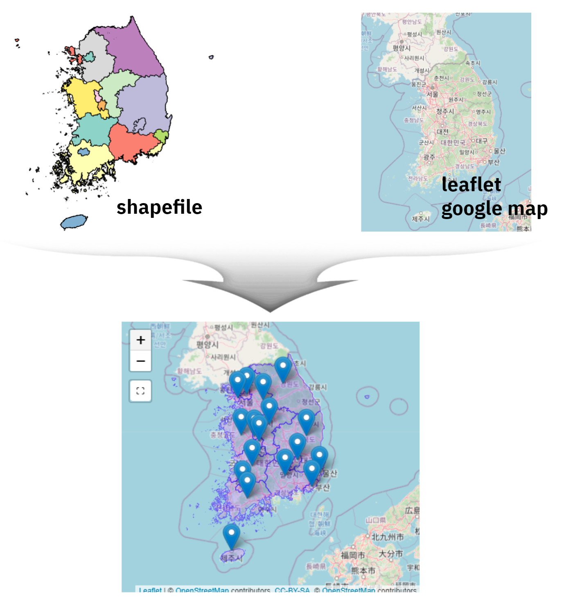
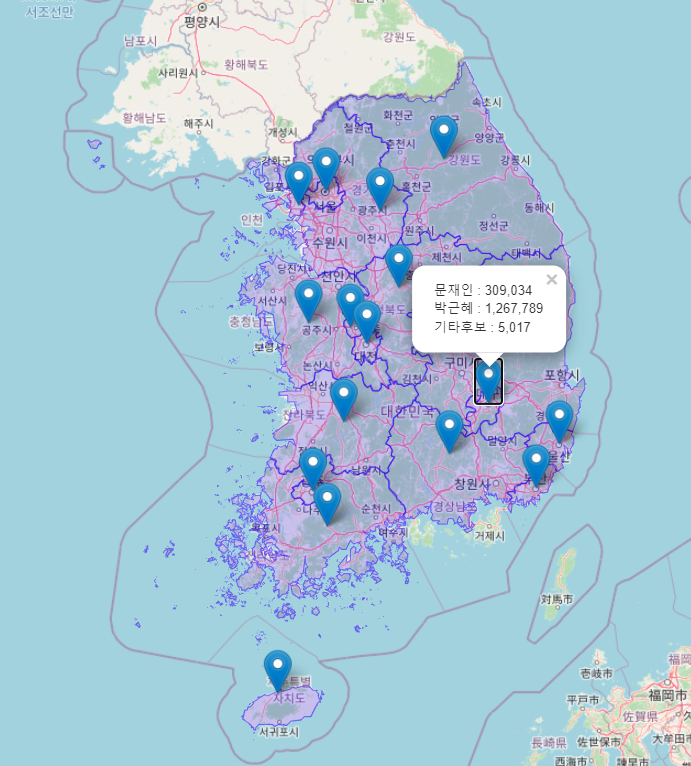

# `shapefile`을 `leaflet` 결합 {#shapefile-leaflet}



## `leaflet` 위에 `shapefile` 오류 [^crs] {#shapefile-leaflet-error}

[^crs]: [한국 주요 좌표계 EPSG코드 및 proj4 인자 정리, OSGeo(Open Source GeoSpatial) 한국어 지부](https://www.osgeo.kr/17)

[대한민국 최신 행정구역(SHP) 다운로드](http://www.gisdeveloper.co.kr/?p=2332)를 다운로드 받아 `leaflet`과 같은 지도위에 올릴려고 하면 `bounding box has potentially an invalid value range for longlat data`와 같은 오류가 생겨 실행이 되지 않는 것은 기본이고 `shapefile` 지도와 기반 `leaflet` 지도가 별도로 표기되어 원하는 결과를 얻을 수가 없다.

```{r shapefile-error, eval = FALSE}
library(tidyverse)
library(leaflet)
library(sf)


sido_sf_raw <- sf::read_sf("data/map/CTPRVN_201311/TL_SCCO_CTPRVN.shp")

sido_sf <- sido_sf_raw %>% 
  mutate(시도명 = iconv(CTP_KOR_NM, from = "CP949", to = "UTF-8", toRaw = FALSE)) %>% 
  dplyr::select(-CTP_KOR_NM, -CTP_ENG_NM)

sido_sf %>% 
  st_set_crs(4235) %>% 
  leaflet() %>%
    addTiles() %>% 
    setView(lng=127.7669, lat=35.90776, zoom=6) %>%
    addProviderTiles(providers$OpenStreetMap) %>% 
    addPolygons(weight = 1,col = 'blue')

1: In sf::st_is_longlat(x) :
  bounding box has potentially an invalid value range for longlat data
2: sf layer has inconsistent datum (+proj=longlat +ellps=intl +towgs84=-186,230,110,0,0,0,0 +no_defs).
Need '+proj=longlat +datum=WGS84' 
```

문제의 원인은 [대한민국 최신 행정구역(SHP) 다운로드](http://www.gisdeveloper.co.kr/?p=2332)에 포함된 좌표계와 `leaflet` 지도와 좌표계가 달라 생기는 문제라 이를 맞춰주면 된다.
대한민국 최신 행정구역(SHP) 지도는 KATEC 계열로 네이버지도에서 사용중인 좌표계 **UTM-K (GRS80)** 인데, `leaflet` 에서 요구하는 좌표계는 전지구 좌표계로 GPS가 사용하는 좌표계 **WGS84 경위도**이다. 이를 맞춰주면 정상적인 결과를 얻을 수 있다.

```{r shapefile-crs, eval = FALSE}

sido_sf_raw <- sf::read_sf("data/map/CTPRVN_201311/TL_SCCO_CTPRVN.shp")

from_crs <- "+proj=tmerc +lat_0=38 +lon_0=127.5 +k=0.9996 +x_0=1000000 +y_0=2000000 +ellps=GRS80 +units=m +no_defs"
to_crs  <- "+proj=longlat +ellps=WGS84 +datum=WGS84 +no_defs"

sido_sf <- sido_sf_raw %>% 
  mutate(시도명 = iconv(CTP_KOR_NM, from = "CP949", to = "UTF-8", toRaw = FALSE)) %>% 
  dplyr::select(-CTP_KOR_NM, -CTP_ENG_NM) %>% 
  st_set_crs(from_crs) %>%
  st_transform(to_crs)

sido_sf %>% 
   leaflet() %>%
     addTiles() %>% 
     setView(lng=127.7669, lat=35.90776, zoom=6) %>%
     addProviderTiles(providers$OpenStreetMap) %>% 
     addMarkers(lng=~lon, lat=~lat, popup=~득표) %>%   
     addPolygons(weight = 1,col = 'blue')
```



