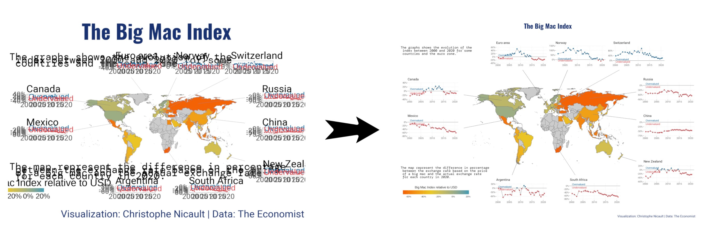

# `ggplot` 그래프 내보내기 {#ggplot-ggsave}



화면에는 제대로 나타나지만 이를 `PNG`, `JPG` 파일로 내보내서 저장시킬 경우 다양한 이유로 인해서 원하는 그래프 결과물을 얻을 수 없다. 즉 `ggplot()`으로 그래프 결과물을 제작한 후에 `ggsave()` 함수로 그래프를 `PNG`, `JPG` 파일로 내보낼 경우 글꼴, 종횡비 등 다양한 원인으로 위와 같은 원치않는 결과를 얻게 된다.

- 글꼴, 글꼴 크기
- 종횡비
- ...


이런 문제를 해결하기 위해서 `ragg` 팩키지 `agg_png()` 함수를 사용해서 이런 문제를 극복해낸다.
`mm` 단위로 `297 X 210`은 가장 많이 사용되는 A4용지가 된다. 즉, `ggplot` 그래프를 A4 용지에 뽑아낼 경우를 상정하고 `png` 파일로 저장시킨다.

```{r ggsave-problem}
library(tidyverse)
library(palmerpenguins)

plt <- penguins %>%
  ggplot(aes(bill_length_mm, bill_depth_mm, color = species)) +
  geom_point()+
  geom_text(x = 45, y = 20, label = "Example of font problem", size = 15/.pt, inherit.aes = FALSE) +
  labs(title = "Bill length and depth relation by species") +
  theme(plot.title = element_text(size = 15))

ragg::agg_png("fig/ragg_penguins_a4.png", width = 297, height = 210, units = "mm", res = 600)
plt
dev.off()
```


로컬파일에 저장시킨 그래프 이미지 파일을 살펴보자.


