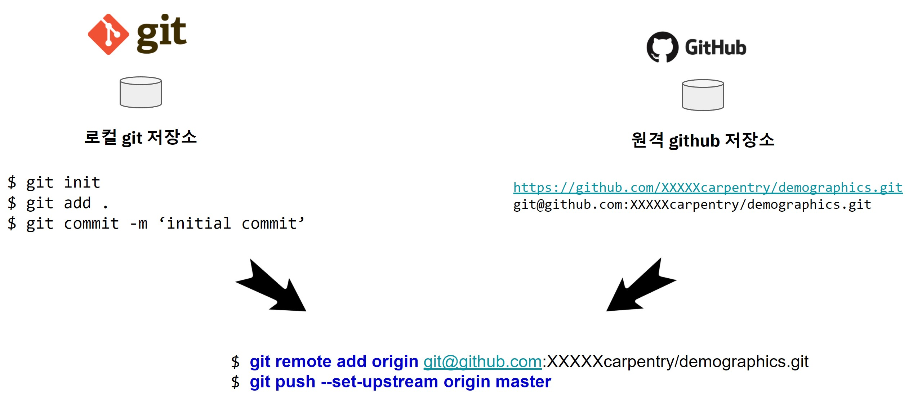
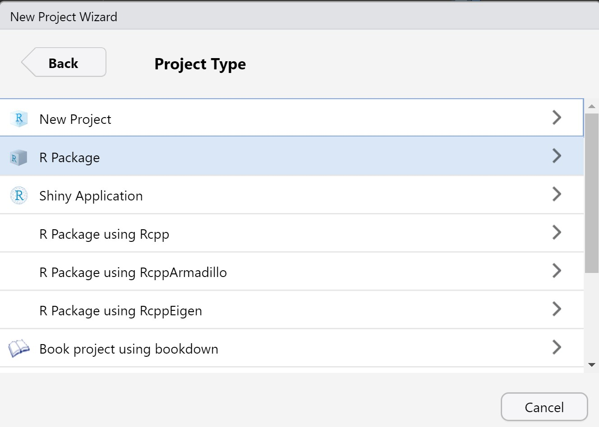
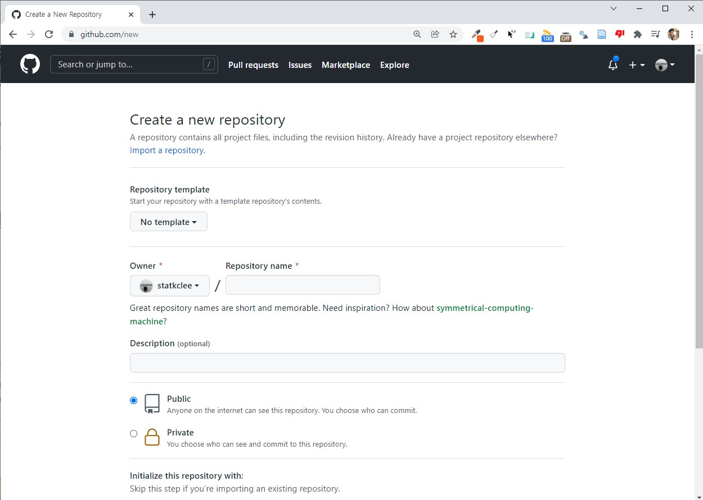

# `github` 저장소 연결 {#github-link}



R 팩키지, `distill`, `blogdown`, `bookdown`, `shiny`, `flexdashboard` 등 다양한 프로젝트로 로컬 컴퓨터에 데이터 과학 제품 개발 작업을 수행한다. 이런 경우 다양한 데이터 과학 프로젝트를 공유와 협업 혹은 백업 목적으로 [github 웹사이트](https://github.com/)에 저장소를 만드는 경우가 매우 많다. 이런 경우 **로컬 git 저장소**와 **원격 `github` 저장소**를 연결할 경우 다음 과정을 통해 동기화 시킨다.

## R 프로젝트 {#r-project}

R 팩키지, `distill`, `blogdown`, `bookdown`, `shiny`, `flexdashboard` 등 다양한 데이터 과학 과제를 R 프로젝트로 생성한다.



## 로컬 `git` 저장소 {#git-repo}

준비한 R 프로젝트를 `git init` 명령어로 로컬 git 저장소를 생성하고 git 작업흐름에 맞춰 작업한다.

```{r git-repo, eval = FALSE}
$ git init
$ git add .
$ git commit -m ‘initial commit’
```


## 원격 `github` 저장소 {#github-repo}

[github 웹사이트](https://github.com/)에서 원격 저장소를 절차를 거쳐 생성한다.



## 로컬과 원격 저장소 연결 {#github-repo-link}

마지막으로, 원격 저장소를 로컬 저장소와 다음 명령어로 연결시키고 연결된 네트워크 정보를 바탕으로 로컬 저장소에서 작업한 사항을 원격 저장소로 보낸다.

```{r git-github-link, eval = FALSE}
$ git remote add origin git@github.com:XXXXXcarpentry/demographics.git # 로컬 저장소를 원격저장소와 연결
$ git remote -v    # 연결된 사항 확인
$ git push --set-upstream origin master  # 로컬 개발 사항 원격 저장소에 푸쉬(공유)
```


