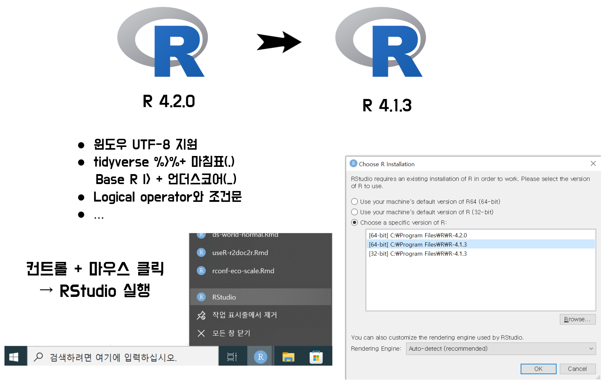

# R 버전 바꾸기(R 4.2.0 &rarr; R 4.1.3) {#r-upgrade}

공식적으로 R 4.2 버젼이 공개되었습니다. 그동안 UTF-8 로케일로 인해 그동안 고통받았던 
인코딩으로부터 진정한 자유를 누릴 수 있을 듯 싶습니다. 

- [다운로드](https://cloud.r-project.org/)
- [R 4.2. 버전 신규 기능](https://www.r-bloggers.com/2022/04/new-features-in-r-4-2-0/)

특히 눈에 띄는 몇가지 기능은 바로 R 4.2. 버젼으로 업그레이드를 유혹하지만,
그동안 작성한 코드가 돌지 않을 것 같은 불안감에 선듯 나서지 못하는 분들도 많다.

실제로 R 4.2. 버전으로 판올림한 이후 4.1.X에서 잘돌던 코드가 제대로 동작하지 않아서 
나감했기 때문에 본 게시글을 작성하게 되었다. 해결 방법은 여러가지 있을 듯 싶지만,
아무래도 가장 확실한 방법은 이전 R 버전 즉 4.1.X 로 되돌아가서 코드를 다시 
돌리는 것이 확실할 듯 싶다.



RStudio IDE로 개발을 주로 하기 때문에 우선 돌아가고자 하는 R 버전 예를 들어 R 4.1.3. 버전을
설치한다. 그렇게 되면 R 엔진이 두개 존재하게 되고 RStudio를 실행할 때 
**컨트롤 + 마우스 클릭**을 하게 되면 실행할 R 버전을 선택할 수 있게 된다.
이와 같이 실행하면 다음과 같이 RStudio에 연결된 R 버젼이 이전 버전으로 돌아간 것을
확인할 수 있다.


```{r r-console, eval = FALSE}
R version 4.1.3 (2022-03-10) -- "One Push-Up"
Copyright (C) 2022 The R Foundation for Statistical Computing
Platform: x86_64-w64-mingw32/x64 (64-bit)

R is free software and comes with ABSOLUTELY NO WARRANTY.
You are welcome to redistribute it under certain conditions.
Type 'license()' or 'licence()' for distribution details.

R is a collaborative project with many contributors.
Type 'contributors()' for more information and
'citation()' on how to cite R or R packages in publications.

Type 'demo()' for some demos, 'help()' for on-line help, or
'help.start()' for an HTML browser interface to help.
Type 'q()' to quit R.

> 

```

- [Changing R versions for the RStudio Desktop IDE](https://support.rstudio.com/hc/en-us/articles/200486138-Changing-R-versions-for-the-RStudio-Desktop-IDE)


